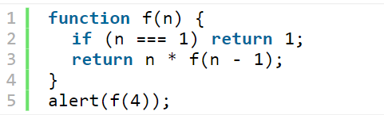

# Что такое рекурсия в javascript?  

## Рекурсия – это термин в программировании, означающий вызов функцией самой себя. Рекурсивные функции могут быть использованы для элегантного решения определённых задач. Когда функция вызывает саму себя, это называется шагом рекурсии.

### Рекурсия является методом решения задачи путем самоподобия или включения двух или более аналогичных элементов друг в друга. Это позволяет нам разбить сложную задачу на более простые подзадачи, которые могут быть решены аналогичным образом, сокращая тем самым сложность решения.
 # Пример
 ## В качестве примера, вычислим факториал с использованием рекурсии:
 
 ## Визуально последовательное выполнение данной функции можно представить так:
 
 ## Выполнение программы многократно спускается вниз, пока не упрётся в условие выхода из рекурсии. Достигнув конца, она идёт обратно, возвращая результаты сделанных вызовов.

## Рекурсивная функция обязательно должна иметь условие завершения, если его не указать, функция будет вызываться до тех пор, пока не будет достигнута максимальная глубина рекурсии, затем будет сгенерировано исключение.

## Общее количество вложенных вызовов называют глубиной рекурсии. Максимальная глубина рекурсии в браузерах ограничена 10 000 рекурсивных вызовов.
# Что такое замыкание?

## Замыкание - это способность функции запоминать переменные, которые были определены внутри родительской функции, даже после того, как родительская функция была выполнена.
# Пример
 
 ## В этом примере мы создали функцию createCounter(), которая создает другую функцию counter(). Внутри функции мы создали переменную count, которая была определена внутри родительской функции. Функция counter() возвращает значение count, увеличивая его на 1. Когда мы вызываем createCounter(), она возвращает функцию counter(), которая имеет доступ к count благодаря замыканию. Каждый раз, когда мы вызываем incrementCounter(),
 ## Замыкание можно представить как способность функции "запоминать" и получать доступ к переменным из окружающего её лексического окружения, даже после завершения выполнения родительской функции. Проще говоря, функция "видит" и может использовать переменные, которые были доступны во время её создания.